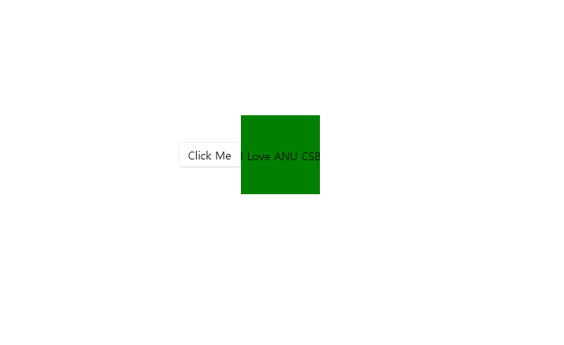

# 사용자 지정 컨트롤
## 실행 화면

## 코드
https://github.com/700400/BgLabelControlApp
```
아래 자료를 보고 천천히 따라하면 완성할 수 있습니다.
```
## 자료
https://learn.microsoft.com/en-us/windows/apps/winui/winui3/xaml-templated-controls-cppwinrt-winui-3
