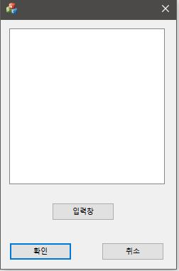
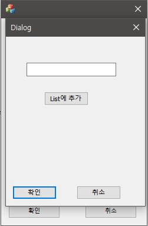
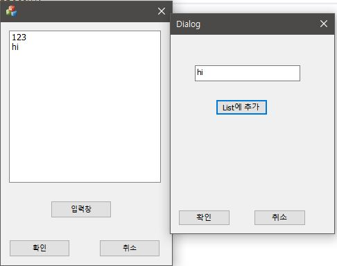
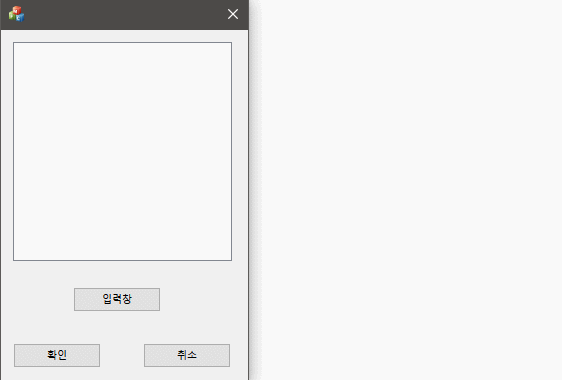

# Modelless다이얼로그 생성하기
## 실행결과
---

---

---

---

---
---
## 제작
* 1. Visual Studio를 실행하여 새로운 프로젝트 생성하기
* 2. MFC앱을 선택해주고 대화상자기반으로 만들기
* 3. 빈 MFC다이얼로그에 ListBox와 Button 넣기
  4. ListBox에 변수 추가하기를 눌러서 m_List변수 생성
  5. 상단의 보기에서 리소스 뷰를 선택하여 Dialog폴더모양 찾기
  6. 우클릭하여 삽입하면 새로운 Dialog가 생성
  7. 생성된 Dialog에 Edit Control과 Button넣기
  8. Dialog빈공간 우클릭해서 클래스 추가 누르기
  9. 클래스 이름에 CSon이라고 쓰고 확인
  10. CSon Dialog의 Edit Control에 m_Str이라는 이름으로 변수 추가하기(범주는 값으로 설정하기)
  11. 본체 Dialog로 돌아와서 CSon을 Modeless형태로 부르게 코딩하기
  12. CSon의 Edit Control에 원하는 글자를 쓰고 Button을 누르면 본체 Dialog의 ListBox에 나타나도록 코딩
