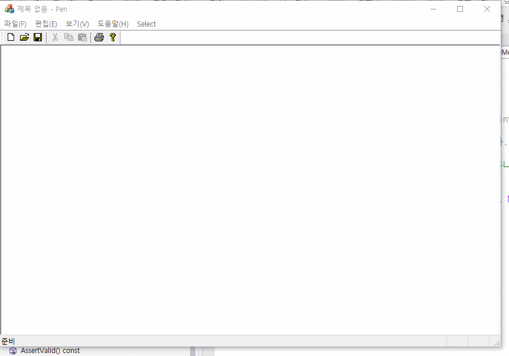

# 퀴즈
* 1.펜의 굵기를 선택할 수 있다.
* 2.펜의 색상을 선택할 수 있다.
* 3.저장할 수 있다.
* 4.읽을 수 있다.
* 5.콘텍스트 메뉴로 굵기와 색상을 선택할 수 있다.
* 6.키보드 1~9까지 누르면 펜의 굵기를 바꿀 수 있다.

## 결과


## 코드
### 중요 필독!!
* 카페에 올라와 있는 SDI기반 펜만들기 코드를 가져와서 아래 PreTranslateMessage와 OnContextMenu를 추가하여 완성
---
---

```cpp
BOOL CPenView::PreTranslateMessage(MSG* pMsg)
{
	// TODO: 여기에 특수화된 코드를 추가 및/또는 기본 클래스를 호출합니다.
	if (pMsg->message == WM_KEYDOWN) {
		if (pMsg->wParam == '1') { Size = 2; } // 키보드 A가 눌러졌을때 메시지 박스 호출
		if (pMsg->wParam == '2') { Size = 4; } // B가 눌러졌을때 다이얼로그에 사각형 그림
		if (pMsg->wParam == '3') { Size = 6; }
		if (pMsg->wParam == '4') { Size = 8; }
		if (pMsg->wParam == '5') { Size = 10; }
		if (pMsg->wParam == '6') { Size = 12; }
		if (pMsg->wParam == '7') { Size = 14; }
		if (pMsg->wParam == '8') { Size = 16; }
		if (pMsg->wParam == '9') { Size = 18; }

	}
	return CView::PreTranslateMessage(pMsg);
}

void CPenView::OnContextMenu(CWnd* pWnd, CPoint point)
{
	// TODO: 여기에 메시지 처리기 코드를 추가합니다.
	CMenu m;
	m.LoadMenuW(IDR_MAINFRAME); // LodaMenuW W는 유니코드까지 포함하는거라 안쓰면 안해도됨
	CMenu* p;
	p = m.GetSubMenu(4);
	p->TrackPopupMenu(NULL, point.x, point.y, this, NULL);
}
```
