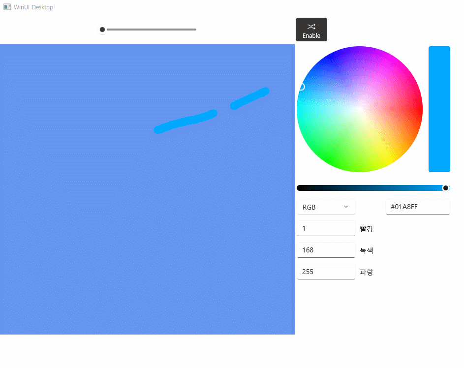

# 14장 색칠 놀이 모음집
## 실행 결과

## 코드
#### Xaml
```xaml
// Copyright (c) Microsoft Corporation and Contributors.
// Licensed under the MIT License.

<Window
    x:Class="Chap14.MainWindow"
    xmlns="http://schemas.microsoft.com/winfx/2006/xaml/presentation"
    xmlns:x="http://schemas.microsoft.com/winfx/2006/xaml"
    xmlns:local="using:Chap14"
    xmlns:d="http://schemas.microsoft.com/expression/blend/2008"
    xmlns:mc="http://schemas.openxmlformats.org/markup-compatibility/2006"
    xmlns:canvas="using:Microsoft.Graphics.Canvas.UI.Xaml"
    mc:Ignorable="d">

    <Grid>
        <Grid.RowDefinitions>
            <RowDefinition Height="60"/>
            <RowDefinition Height="590"/>
        </Grid.RowDefinitions>
        <Grid.ColumnDefinitions>
            <ColumnDefinition Width="600"/>
            <ColumnDefinition Width="400"/>
        </Grid.ColumnDefinitions>

        <StackPanel Orientation="Horizontal" HorizontalAlignment="Center" VerticalAlignment="Center">
            <Slider AutomationProperties.Name="simple_slider" Width="200" Grid.Column="0" Grid.Row="0"
                    ValueChanged="Slider_ValueChanged" x:Name="slider" />
        </StackPanel>

        <canvas:CanvasControl Grid.Column="0" Grid.Row="1"
                              PointerPressed="CanvasControl_PointerPressed"
                              PointerReleased="CanvasControl_PointerReleased"
                              PointerMoved="CanvasControl_PointerMoved"
                              Draw="CanvasControl_Draw"
                              ClearColor="CornflowerBlue"/>

        <AppBarToggleButton Grid.Column="1" Grid.Row="0"
                            x:Name="ColorPicker" Icon="Shuffle" IsChecked="True"
                            Label="Enable" Click="ColorPicker_Click"/>

        <Border Grid.Column="1" Grid.Row="1" x:Name="colorPanel" Visibility="Visible">
            <ColorPicker
                ColorChanged="ColorPicker_ColorChanged"
                ColorSpectrumShape="Ring"
                IsMoreButtonVisible="False"
                IsColorSliderVisible="True"
                IsColorChannelTextInputVisible="True"
                IsHexInputVisible="True"
                IsAlphaEnabled="False"
                IsAlphaSliderVisible="True"
                IsAlphaTextInputVisible="True"/>
        </Border>
    </Grid>
</Window>
```
---
---
#### cpp파일
```c++
// Copyright (c) Microsoft Corporation and Contributors.
// Licensed under the MIT License.

#include "pch.h"
#include "MainWindow.xaml.h"
#if __has_include("MainWindow.g.cpp")
#include "MainWindow.g.cpp"
#endif

using namespace winrt;
using namespace Microsoft::UI::Xaml;
struct winrt::Windows::UI::Color myCol = winrt::Microsoft::UI::Colors::Green();
namespace winrt::Chap14::implementation
{
    MainWindow::MainWindow()
    {
        InitializeComponent();
        flag = false;
        px = py = 100;
        mySize = 16;
        IsChecked = true;
    }

    int32_t MainWindow::MyProperty()
    {
        throw hresult_not_implemented();
    }

    void MainWindow::MyProperty(int32_t /* value */)
    {
        throw hresult_not_implemented();
    }
}

void winrt::Chap14::implementation::MainWindow::Slider_ValueChanged(winrt::Windows::Foundation::IInspectable const& sender, winrt::Microsoft::UI::Xaml::Controls::Primitives::RangeBaseValueChangedEventArgs const& e)
{
    mySize = e.NewValue();
}

void winrt::Chap14::implementation::MainWindow::CanvasControl_PointerPressed(winrt::Windows::Foundation::IInspectable const& sender, winrt::Microsoft::UI::Xaml::Input::PointerRoutedEventArgs const& e)
{
    flag = true;
}

void winrt::Chap14::implementation::MainWindow::CanvasControl_PointerReleased(winrt::Windows::Foundation::IInspectable const& sender, winrt::Microsoft::UI::Xaml::Input::PointerRoutedEventArgs const& e)
{
    flag = false;
    px = py = 0.0;
    vx.push_back(px);
    vy.push_back(py);
    col.push_back(myCol);
    size.push_back(mySize);
}

void winrt::Chap14::implementation::MainWindow::CanvasControl_PointerMoved(winrt::Windows::Foundation::IInspectable const& sender, winrt::Microsoft::UI::Xaml::Input::PointerRoutedEventArgs const& e)
{
    CanvasControl canvas = sender.as<CanvasControl>();
    px = e.GetCurrentPoint(canvas).Position().X;
    py = e.GetCurrentPoint(canvas).Position().Y;
    if (flag) {
        vx.push_back(px);
        vy.push_back(py);
        col.push_back(myCol);
        size.push_back(mySize);
        canvas.Invalidate();
    }
}

void winrt::Chap14::implementation::MainWindow::CanvasControl_Draw(winrt::Microsoft::Graphics::Canvas::UI::Xaml::CanvasControl const& sender, winrt::Microsoft::Graphics::Canvas::UI::Xaml::CanvasDrawEventArgs const& args)
{
    CanvasControl canvas = sender.as<CanvasControl>();
    int n = vx.size();
    if (n <= 2) return;

    for (int i = 1; i < n; i++) {
        if (vx[i] == 0.0 && vy[i] == 0.0) {
            i++; continue;
        }
        args.DrawingSession().DrawLine(vx[i - 1], vy[i - 1], vx[i], vy[i], col[i], size[i]);
        args.DrawingSession().FillCircle(vx[i - 1], vy[i - 1], size[i] / 2, col[i]);
        args.DrawingSession().FillCircle(vx[i], vy[i], size[i] / 2, col[i]);
    }
}

void winrt::Chap14::implementation::MainWindow::ColorPicker_Click(winrt::Windows::Foundation::IInspectable const& sender, winrt::Microsoft::UI::Xaml::RoutedEventArgs const& e)
{
    if (IsChecked) {
        IsChecked = FALSE;
        ColorPicker().Label(L"Disable");

        colorPanel().Visibility(Visibility::Collapsed);
        slider().Visibility(Visibility::Collapsed);
    }
    else {
        IsChecked = TRUE;
        ColorPicker().Label(L"Enable");

        colorPanel().Visibility(Visibility::Visible);
        slider().Visibility(Visibility::Visible);
    }
}

void winrt::Chap14::implementation::MainWindow::ColorPicker_ColorChanged(winrt::Microsoft::UI::Xaml::Controls::ColorPicker const& sender, winrt::Microsoft::UI::Xaml::Controls::ColorChangedEventArgs const& args)
{
    myCol = args.NewColor();
}
```
---
---
#### 헤더
```c++
// Copyright (c) Microsoft Corporation and Contributors.
// Licensed under the MIT License.

#pragma once

#include "MainWindow.g.h"
#include <winrt/Microsoft.Graphics.Canvas.UI.Xaml.h> // canvas
#include <winrt/Microsoft.UI.Xaml.Input.h> // Draw()
#include <winrt/Microsoft.UI.Input.h>

using namespace winrt::Microsoft::UI;
using namespace winrt::Microsoft::Graphics::Canvas::UI::Xaml;

namespace winrt::Chap14::implementation
{
    struct MainWindow : MainWindowT<MainWindow>
    {
        MainWindow();

        int32_t MyProperty();
        bool flag;
        bool IsChecked;
        float px, py;
        float mySize;
        std::vector<float> vx;
        std::vector<float> vy;
        std::vector<struct winrt::Windows::UI::Color> col;
        std::vector<float> size;
        void MyProperty(int32_t value);
     
        void Slider_ValueChanged(winrt::Windows::Foundation::IInspectable const& sender, winrt::Microsoft::UI::Xaml::Controls::Primitives::RangeBaseValueChangedEventArgs const& e);
        void CanvasControl_PointerPressed(winrt::Windows::Foundation::IInspectable const& sender, winrt::Microsoft::UI::Xaml::Input::PointerRoutedEventArgs const& e);
        void CanvasControl_PointerReleased(winrt::Windows::Foundation::IInspectable const& sender, winrt::Microsoft::UI::Xaml::Input::PointerRoutedEventArgs const& e);
        void CanvasControl_PointerMoved(winrt::Windows::Foundation::IInspectable const& sender, winrt::Microsoft::UI::Xaml::Input::PointerRoutedEventArgs const& e);
        void CanvasControl_Draw(winrt::Microsoft::Graphics::Canvas::UI::Xaml::CanvasControl const& sender, winrt::Microsoft::Graphics::Canvas::UI::Xaml::CanvasDrawEventArgs const& args);
        void ColorPicker_Click(winrt::Windows::Foundation::IInspectable const& sender, winrt::Microsoft::UI::Xaml::RoutedEventArgs const& e);
        void ColorPicker_ColorChanged(winrt::Microsoft::UI::Xaml::Controls::ColorPicker const& sender, winrt::Microsoft::UI::Xaml::Controls::ColorChangedEventArgs const& args);
    };
}

namespace winrt::Chap14::factory_implementation
{
    struct MainWindow : MainWindowT<MainWindow, implementation::MainWindow>
    {
    };
}

```
