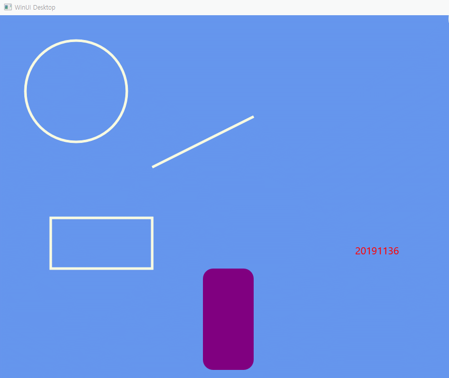

# WinUI3 에서 Win2D를 활용하여 5가지 이상의 도형이나 글씨를 구현하시오.
## 우선 작업
* visual studio installer -> C++을 이용한 데스크톱 개발 -> "Windows 10 SDK(10.0.19041.0)"과 "Windows 앱 SDK C++ 템플릿" 설치
* 프로젝트 -> NuGet패키지 관리 -> 찾아보기 -> winui2d 검색 -> 주황색 아이콘 앱 1.0.5.1 설치
## 실행 화면

## 코드 추가
### 헤더
```
#include <winrt/Microsoft.Graphics.Canvas.UI.Xaml.h> // 캔버스를 쓰기 위함
#include <winrt/Microsoft.UI.Xaml.Input.h>
#include <winrt/Microsoft.UI.Input.h> //마우스를 쓰기 위함


float px, py; // struct MainWindow 내부에
```

### cpp파일
```
using namespace winrt::Microsoft::Graphics::Canvas::UI::Xaml;
struct winrt::Windows::UI::Color col = winrt::Microsoft::UI::Colors::LightYellow();

// MainWindow함수 내부
px = 200;
py = 200;


CanvasControl_PointerMoved 함수 내부

    CanvasControl canvas = sender.as<CanvasControl>();
    px = e.GetCurrentPoint(canvas).Position().X;
    py = e.GetCurrentPoint(canvas).Position().Y;
    canvas.Invalidate();


CanvasControl_Draw 함수 내부

    args.DrawingSession().DrawCircle(150, 150, 100, col, 5);
    args.DrawingSession().DrawLine(300, 300, 500, 200, col, 5);
    args.DrawingSession().DrawRectangle(100, 400, 200, 100, col, 5);
    args.DrawingSession().FillRoundedRectangle(400, 500, 100, 200, 20, 20, winrt::Microsoft::UI::Colors::Purple());
    args.DrawingSession().FillEllipse(px, py, 80, 60, col);
    args.DrawingSession().DrawText(L"20191136", 700, 450, winrt::Microsoft::UI::Colors::Red());
```

### xaml파일
```
xmlns:canvas="using:Microsoft.Graphics.Canvas.UI.Xaml"

<Grid>
        <canvas:CanvasControl
            PointerMoved="CanvasControl_PointerMoved"
            Draw="CanvasControl_Draw"
            ClearColor="CornflowerBlue"
            >
        </canvas:CanvasControl>
    </Grid>

```
