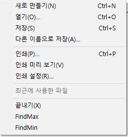
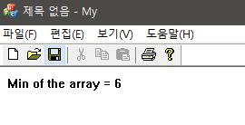

# 멀티스레드를 이용한 최소값 찾기
## 코드
```c++
UINT MyThread(LPVOID pParam);
UINT MyThread(LPVOID pParam)
{
    SData * pData = (SData*)pParam;
        // Find max 여기에 최대값을 찾는 프로그램을 작성하세요.
	  for (int i = 1 ; i < 5; i++) {
		  if (pData->array[i] < pData->min)
				pData->min = pData->array[i];
  	}

  	::PostMessage(pData->NotifyWindow, WM_MAX, 0, 0);
	  return 0;
}
LRESULT CMyView::OnMaxFound(WPARAM wParam, LPARAM lParam)
{
	CMyDoc *pDoc = GetDocument();
	ASSERT_VALID(pDoc);
	CString msg;
	msg.Format(L"Min of the array = %d", data.min);
	pDoc->str = msg;
	TerminateThread(Thread, 0);
	Invalidate();
	return 0L;
}

void CMyView::OnFindMin()
{
		data.array[0] = 25;
		data.array[1] = 32;
		data.array[2] = 12;
		data.array[3] = 6;
		data.array[4] = 41;
		data.array[5] = 17;
		data.array[6] = 20;
		data.array[7] = 3;
		data.array[8] = 55;
		data.array[9] = 8;

		data.min = 100;
		data.NotifyWindow = m_hWnd;
		AfxBeginThread(MyThread, &data);
}
```
```
최소값을 찾는 Thread를 만들어서 메뉴상의 OnFindMin을 눌렀을 때 배열에 값을 할당하고 스레드를 만들어서 이 데이터를
넘겨줘서 Thread에서 최소값을 찾는 로직을 수행하고 WM_MAX를 호출해서 OnMaxFound를 최종적으로 호출하여
Doc 파일에 있는 str에 msg.Format()을 통해 문자열을 넘겨줘서 OnDraw에서 최종적으로 SDI위에 출력
```

## 실행


