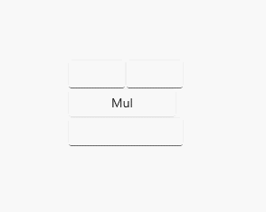
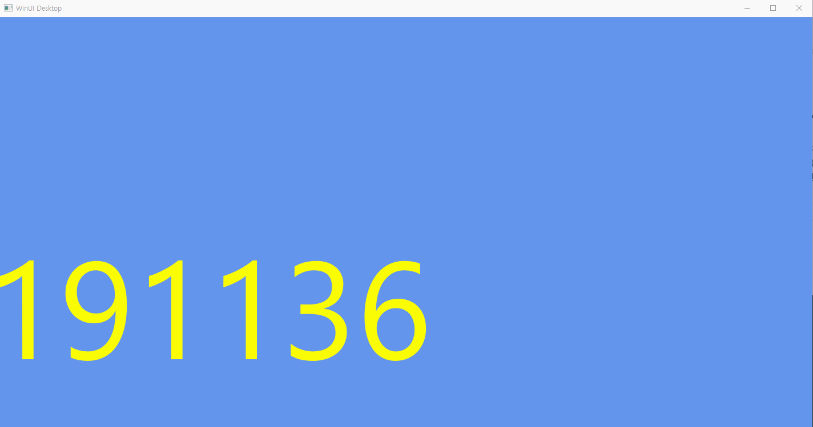

# win2d를 이용한 배너와 c#을 이용한 곱셈 계산기
## C#을 이용한 곱셈 계산기
### 실행 화면

### 주요 코드
```xaml
<StackPanel Orientation="Vertical" HorizontalAlignment="Center" VerticalAlignment="Center">
        <StackPanel Orientation="Horizontal" HorizontalAlignment="Center" VerticalAlignment="Center">
            <TextBox x:Name="tb1" TextAlignment="Center"></TextBox>
            <TextBox x:Name="tb2" TextAlignment="Center"></TextBox>
        </StackPanel>
        <Button x:Name="bt1" Click="bt1_Click" Width="120">Mul</Button>
        <TextBox x:Name="tb3" TextAlignment="Center"></TextBox>
    </StackPanel>
```
```c#
private void bt1_Click(object sender, RoutedEventArgs e)
        {
            double a, b, c;
            double.TryParse(tb1.Text, out a);
            double.TryParse(tb2.Text, out b);
            c = a * b;
            tb3.Text=c.ToString();
        }
```
---
## win2D를 이용한 배너 만들기
### 실행화면

### 주요코드
```xaml
xmlns:canvas="using:Microsoft.Graphics.Canvas.UI.Xaml"

<Grid>
        <canvas:CanvasControl
            PointerMoved="CanvasControl_PointerMoved"
            Draw="CanvasControl_Draw"
            ClearColor="CornflowerBlue"
            >
        </canvas:CanvasControl>
    </Grid>
```
```c++
#include <winrt/Microsoft.Graphics.Canvas.Text.h>
using namespace winrt::Microsoft::Graphics::Canvas::Text;

int a;
void winrt::App1::implementation::MainWindow::CanvasControl_Draw(winrt::Microsoft::Graphics::Canvas::UI::Xaml::CanvasControl const& sender, winrt::Microsoft::Graphics::Canvas::UI::Xaml::CanvasDrawEventArgs const& args)
{
    CanvasTextFormat format;
    CanvasControl canvas = sender.as<CanvasControl>();
    format.HorizontalAlignment(CanvasHorizontalAlignment::Center);
    format.VerticalAlignment(CanvasVerticalAlignment::Center);
    format.FontSize(242.0f);

    args.DrawingSession().DrawText(L"20191136", a, 500, winrt::Microsoft::UI::Colors::Yellow(),format);
    a = a + 5;

    if (a > 1200) a = 0;

    canvas.Invalidate();
}
```
