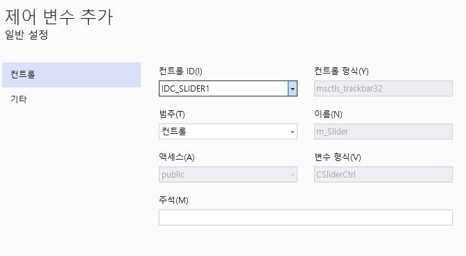

# 펜 만들기
## MFC

```
좌측 상단에 펜의 굵기를 조정해줄 slider를 배치하여
막대가 왼쪽으로 갈수록 펜이 얇아지고 오른쪽으로 갈수록 펜이 굵어지게 된다.
중앙 하단에 색상 변경 버튼을 추가하여 펜의 색상을 변경 할 수 있게 했다.
```

```
슬라이더를 우클릭하여 변수 추가를 눌러서
이름칸에 m_Slider를 추가한다.
```

```
이번엔 이벤트 처리기 추가를 선택하여 클래스 목록 콤보박스를 선택하여
가장 아래 본인의 파일 명이 들어간 선택지의 Dlg를 선택한다.
```
## 코드

---
```
160~163
이후 코드에서 사용할 전역변수들이다.
int n은 추후 슬라이더의 값을 받아서 펜의 굵기를 정하게 될 변수
COLORREF m_col은 매크로변수로 펜의 색상을 바꿀때 사용할 변수
CPoint opnt는 바로 아래 함수에서 펜의 시작위치를 정해줄 변수이며 초기화하지 않으면
자동으로 0이 들어간다
```
---
---


